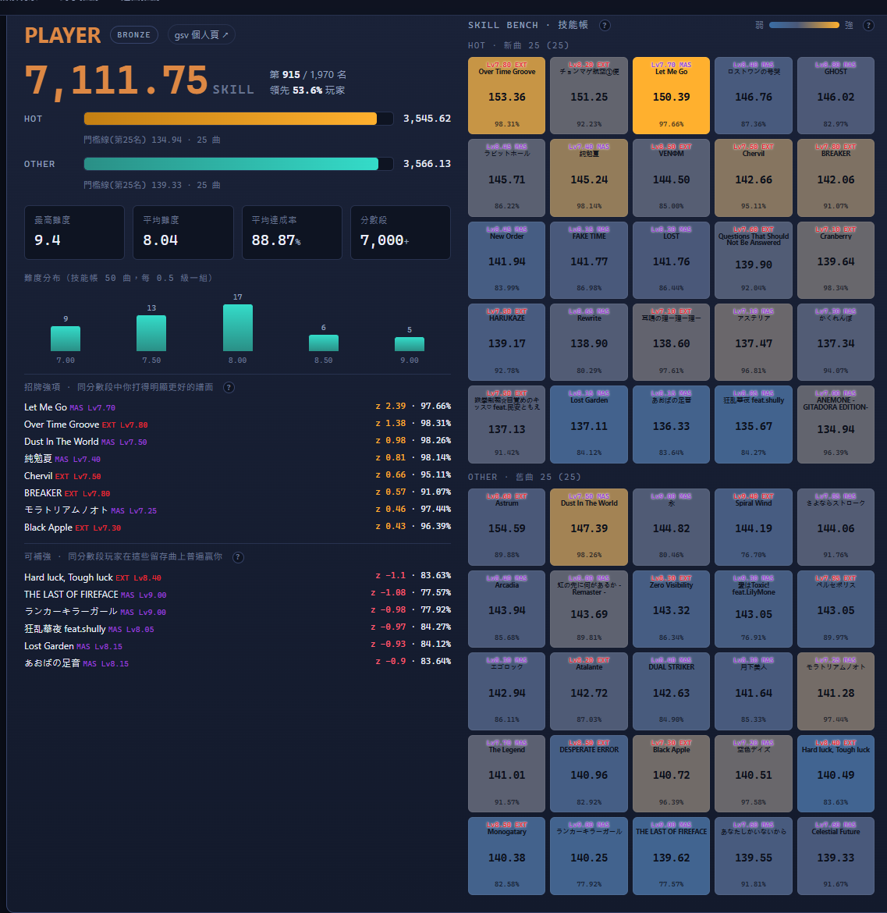

# GD Skill Match — GITADORA DrumMania / GuitarFreaks 技能配對與選曲推薦

**線上版**：<https://gdskill-43090965539.asia-east1.run.app>（GCP Cloud Run，每日自動更新資料）

支援兩種曲種：**DrumMania** 與 **GuitarFreaks**，右上角可一鍵切換（DM ⇄ GF）。
GuitarFreaks 沿用與 DrumMania **完全相同**的方法，差別只在於 GF 的吉他（G）與貝斯（B）
譜面為各自獨立的譜面（GF 技能橫跨兩者），以 `(曲名, 難度, part)` 作為譜面識別。

一個 web application：輸入任一位 GITADORA 玩家，工具會用統計方法

1. **定位玩家** — 分析他「擅長什麼」（相對**同分數段**玩家的強弱指紋，越級曲也以同段位為基準）。
2. **找出相似玩家** — 依「選曲口味 + 演奏強弱模式」找出風格最接近的人（與總分高低無關）。
3. **推薦對手 (Rival)** — 風格相近、實力可及、適合加為 RIVAL 互相追趕的玩家。
4. **推薦樂曲** — 兩種角度：相似玩家普遍在玩的「口味發掘」曲、以及能實際拉高你總 skill 的「提升總分」曲；交集即「甜蜜點」。

點技能帳上任一張**鼓墊**，會彈出該曲的「同分數段狀況」：同段（±300 分）有多少人在打、達成率分布、
你贏過同段幾 % 的人，以及同段玩家在這首的成績排名（含各自總 skill）。

以**單曲 skill** 與**總 skill** 作為評量標準，每一項推薦都附**可解釋的理由與信心度**。
玩家名稱與 SKILL 數字採用 **GITADORA 官方分級配色**（`tier = floor(SP/500)`，與 gsv 相同：
…綠 / 藍 / 紫 / 紅 / 銅 / 銀 / 金 / 虹），一眼看出段位（例如 7523 分為 SILVER 銀段）。
介面支援 **繁中 / English / 日本語 / 한국어**，右上角可切換。



---

## 快速開始

需求：Python 3.10+，以及 `numpy / scipy / scikit-learn`（網頁伺服器本身只用標準庫）。

```powershell
# Windows / PowerShell
pip install -r requirements.txt
./run.ps1
```

```bash
# macOS / Linux / Git Bash
pip install -r requirements.txt
./run.sh
```

啟動後瀏覽器開啟 <http://127.0.0.1:8770/>，預設載入目前排名第一的玩家。
頂端搜尋框可切換任何玩家；網址 `?p=<id>` 可直接深連結。

首次執行時 `run.ps1` / `run.sh` 會自動從 gsv.fun 抓取資料並建立分析檔（約 1 分鐘），
之後即離線可用。爬下來的第三方玩家資料不隨 repo 散布（已 gitignore）。若要更新到最新資料：

```powershell
./run.ps1 -Fetch                      # 重新從 gsv.fun 抓取 + 重建（DrumMania）
./run.ps1 -Instrument guitar -Fetch   # 抓取 + 建立 GuitarFreaks 資料（gsv type:g）
```

伺服器會自動提供所有「已建好」的曲種；兩種都建好後，頁面右上角才會出現 DM⇄GF 切換鈕。
沒有 gsv 連線也想預覽介面時，可用合成示範資料：

```powershell
python pipeline/make_demo.py --version demo --instrument drum
python pipeline/make_demo.py --version demo --instrument guitar
python server/app.py --version demo    # 開 http://127.0.0.1:8770/ ，右上可切 DM⇄GF
```

---

## 資料來源

資料來自社群網站 **[Gitadora Skill Viewer (gsv.fun)](http://gsv.fun)** 的公開 GraphQL API —
玩家透過官方 eAmusement 的書籤工具上傳自己的技能帳並公開分享。本工具只讀取公開資料，
並在介面中回連到每位玩家的 gsv 個人頁。感謝 gsv.fun 與 GITADORA 社群。

> 注意：技能帳只包含每位玩家「當前計入總分的最強 50 譜面」（HOT 新曲 25 + OTHER 舊曲 25），
> 並非完整遊玩紀錄，因此分析帶有**倖存者偏差**（只看得到夠強、留在帳上的曲）。所有方法與
> 文案都據此設計，並以信心度標示證據強弱。

本次資料快照（版本 **GALAXY WAVE DELTA**）：**1,970 位** DrumMania 玩家、**3,920** 張不同譜面。

---

## 方法論

每位玩家是一條跨 ~3920 譜面的稀疏向量（只有 50 個非零）。為了把「整體強度」與「選曲風格」
分開，我們**不**用單一不透明分數，而是同時計算三個可見信號：

| 信號 | 定義 | 捕捉到的東西 |
|------|------|------|
| **taste（口味）** | 以 IDF 加權的 Jaccard（共同擁有的譜面，熱門曲降權） | 選曲偏好，而非人人都打的曲 |
| **style（風格）** | 各譜面 z-score 向量的 cosine（你在該曲相對其他擁有者的強弱） | 演奏強弱模式（達成率殘差） |
| **latent（潛在）** | z 向量做 TruncatedSVD(32) 後的 cosine | 去雜訊的潛在風格（次要參考） |

- **玩家強項 / 可補強（profile）**：用**同分數段加權 z-score** — 每張譜面只跟「總分接近你的玩家」
  比（依 SP 接近度加權），而非跟全體持有者比。這樣你**越級**打的高難曲若打得不錯，不會因為該曲
  多是強者在用而被低估；反之同段位普遍比你高的曲會被標為「可補強」練習目標。
- **相似玩家**：以 `0.55·style + 0.45·taste` 排序（等級無關），並回報 taste / style / latent /
  共同曲數 / 總分差 / 信心度的**完整分項**。
- **對手 (Rival)**：在相似度上再乘「總分接近度」高斯權重，分成
  `同級對手 / 成長目標（略強）/ 追趕者（略弱）/ 憧憬目標（更高）`，並列出雙方互有勝負的譜面。
- **選曲 — 口味發掘**：你沒練、但相似玩家普遍擁有的譜面（鄰居加權頻率）。
- **選曲 — 提升總分**：估算你在候選曲的可達成率（混合**同級玩家平均達成率** + 該分數段
  **kasegi 聚合先驗** + 全域平均），換算單曲 skill = `等級 × 20 × 達成率`，若**明顯超過**你
  HOT/OTHER 第 25 名門檻才推薦，並以信心度折扣排序（避免在截尾資料上做假精確推薦）。
- **甜蜜點**：同時是「相似玩家愛玩」且「能提升總分」的曲。

> 方法論在開發時與 Codex 進行過一輪對抗式 review，重點修正包括：三信號分離、熱門曲 IDF 降權、
> 以達成率殘差（而非 raw skill）判斷強項、對僅略超門檻的提升曲扣分、把 SVD 降為次要信號等。

---

## 架構

```
gdskill-match/
├─ pipeline/
│  ├─ fetch_data.py      # 從 gsv.fun GraphQL 抓玩家清單 + 技能帳 + kasegi（--instrument drum|guitar）
│  ├─ build_dataset.py   # 建譜面目錄、player×chart 矩陣、per-chart 統計、SVD 嵌入（--instrument）
│  └─ make_demo.py       # 合成離線示範資料（無需連 gsv，可預覽 UI 與 DM⇄GF 切換）
├─ server/
│  ├─ engine.py          # 推薦引擎：相似度 / 對手 / 選曲（numpy；依 instrument 載入對應資料）
│  └─ app.py             # 零依賴 HTTP 伺服器（http.server）：JSON API + 靜態前端
├─ web/                  # 前端 SPA（原生 JS，無建置步驟；含 DM⇄GF 切換 + GitHub issue 入口）
│  ├─ index.html  styles.css  app.js  i18n.js
├─ data/
│  ├─ raw/                          # players_<instrument>_<ver>.jsonl / kasegi_<instrument>_<ver>.json
│  └─ processed/<ver>/<instrument>/ # charts.json / players.json / matrix.npz / kasegi.json / meta.json
├─ run.ps1  run.sh  requirements.txt
```

曲種以 `instrument`（`drum` / `guitar`）參數貫穿整個技術棧；`drum` 為預設，現有行為不變。

API（`http://127.0.0.1:8770/api/...`）：所有端點接受 `?inst=drum|guitar`（預設 drum）。
`GET /api/meta`（回傳 `instrument` 與可用的 `instruments`）、`/api/search?q=`、`/api/top`、
`/api/player/<id>/{profile|similar|rivals|songs|all}`。

---

## 每位玩家會看到什麼

- **玩家讀數**：總 skill、全站排名/領先百分比、HOT/OTHER 分數與第 25 名門檻線、難度分布，
  以及把技能帳 50 曲畫成鼓墊格陣（顏色＝相對同分數段的強弱）、招牌強項與可補強清單。
- **相似玩家**：依風格(style)/口味(taste)/潛在(latent)三信號排序，附共同曲、總分差、信心度。
- **對手推薦**：同級/成長/追趕/憧憬四類，含雙方互有勝負的曲目。
- **選曲推薦**：甜蜜點 / 提升總分 / 口味發掘三類，每首附預估提升、達門檻所需達成率與理由。

（實際數字依 gsv.fun 上的資料即時計算，會隨資料更新而變動。）

---

## 上傳完整資料（選用，讓分析更精準）

gsv 技能帳只有「最強 50 曲」，帶有倖存者偏差。自願的玩家可以用書籤工具（bookmarklet）
從 KONAMI **e-amusement 官方頁**抓取自己的**完整遊玩資料**（含每曲達成率）並上傳，把自己的
向量**稠密化**，使個人頁／相似玩家／選曲推薦更準確。上傳資料走 **overlay 疊加層**，
**絕不**寫進 `matrix.npz` 或改動 base 的 per-chart 統計。

操作（前端「上傳資料」分頁，每位玩家頁底部）：

1. **安裝書籤**：把「GD 上傳完整資料」連結拖到瀏覽器書籤列（它會載入 `web/bookmarklet.js`）。
2. **在 e-amusement 執行**：登入官方頁後點該書籤。標準模式約 5–10 分鐘——先掃 37 個曲別列表頁，
   再針對性抓取約 120 首詳細達成率；採**序列化節流**（類別頁 1–1.5s、detail 2–3s + jitter，
   遇 429/5xx 退避並停止）以降低伺服器負擔，完成後下載一個正規化 JSON。
3. **上傳 JSON**：在同一頁選擇剛下載的檔案送出（**同源**上傳，避開 CORS）。

隱私（spec §5、§8、§9）：

- 身分為**自陳**（無伺服器端 KONAMI 驗證），以玩家名 + DM skillpoint 機率式連結；模糊/失敗
  → 隔離保存，**不覆蓋**既有資料。
- **預設私有**：上傳後只有你（憑回傳的分享權杖）看得到強化結果；可一鍵公開成為他人可比較的節點。
- **絕不**存取或傳輸卡號（カードナンバー）／cookie／原始 HTML。

上傳路由（`POST /api/upload`、`/api/publish`）**預設關閉**（公開的 Cloud Run 維持唯讀）。
本機啟用：

```powershell
$env:GD_ENABLE_UPLOAD = "1"; ./run.ps1      # 或 python server/app.py --enable-upload
```

書籤解析器有 Node 單元測試：`node --test web/bookmarklet.test.mjs`。

---

## 部署到 GCP（Cloud Run + 排程 Cloud Function）

架構（`$PROJECT_ID`、`$GCS_BUCKET` 等為你自己的設定，不寫死在 repo）：

- **Cloud Run**（`gdskill`）：容器化 `app.py`，scale-to-zero；啟動時從 GCS 載入分析檔（唯讀）。
- **GCS**（`$GCS_BUCKET`）：存放 `processed/<version>/` 的分析檔。
- **Cloud Function 2nd gen**（`gdskill-updater`，專屬最小權限 SA）+ **Cloud Scheduler**（每日 00:00 Asia/Taipei）：
  重新爬 gsv.fun、重建分析檔、上傳 GCS。網頁左上角的「資料更新」日期即來自此。

一鍵部署（需先 `gcloud auth login`，並以環境變數提供帳號設定，不留存於 repo）：

```bash
PROJECT_ID=your-project BILLING_ACCOUNT=XXXXXX-XXXXXX-XXXXXX ./deploy.sh
```

`Dockerfile`（Cloud Run 服務）、`updater/`（排程函式，含 pipeline 副本）、`server/cloudstore.py`
（GCS 同步）、`deploy.sh` 為部署相關檔案。低流量下幾乎落在免費額度；詳見 [`docs/deployment.md`](docs/deployment.md)。

雲端要同時提供 GuitarFreaks，於 Cloud Run 與 updater 設環境變數 `GD_INSTRUMENTS=drum,guitar`
（預設 `drum`）；排程 updater 會每日重建並上傳每個曲種的分析檔。

## 隱私與安全

本 repo 為**公開**，且刻意不含任何金鑰／密碼／權杖／GCP 專案或服務帳號識別碼——`deploy.sh`
一律從環境變數讀取帳號設定。第三方玩家資料與所有衍生檔（含上傳 overlay）都在 `data/`／
`userdata/` 之下，已 gitignore，不隨 repo 散布。公開服務僅有唯讀 `GET`；上傳路由預設關閉。
上傳**絕不**存取或傳輸卡號／cookie／原始 HTML，且預設私有。詳見 [`SECURITY.md`](SECURITY.md)
（含漏洞回報方式）。頁面右上角的 GitHub icon 可直接開 issue 回報問題或建議。

## 限制與備註

- 只涵蓋有上傳到 gsv.fun 的玩家，非全體 GITADORA 玩家。
- 技能帳是「最強 50 曲」截尾資料；強項與推薦都是相對於此截尾母體。
- 提升總分的達成率為**估計值**，實際表現因人而異；信心度低的推薦請當作參考。
- **DrumMania** 與 **GuitarFreaks** 皆已支援（右上角切換）。完整資料**上傳**目前僅支援
  DrumMania（書籤工具抓 e-amusement 的 `gtype=dm`）；GuitarFreaks 提供完整的唯讀分析
  （個人頁／相似玩家／對手／選曲）。
